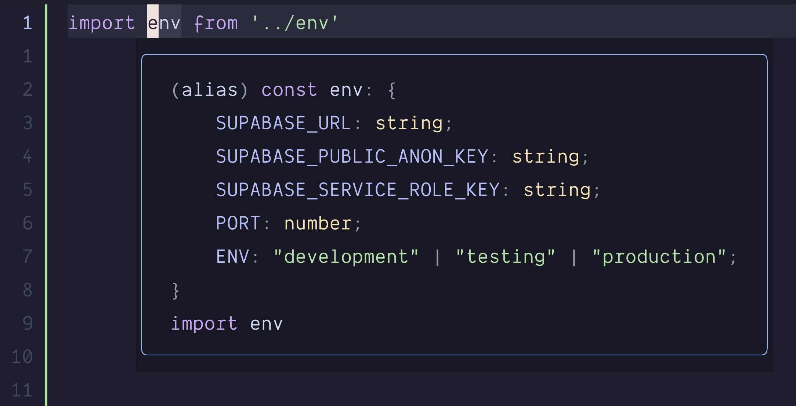
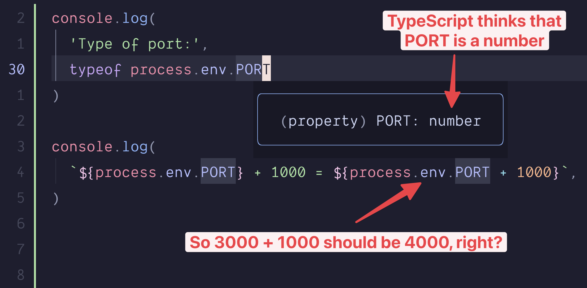
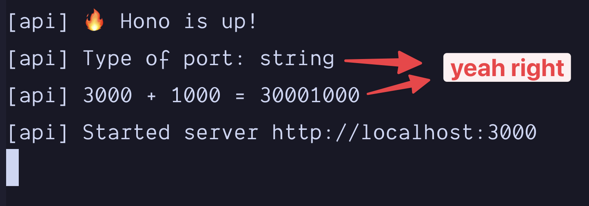

<iframe
  width='100%'
  style='aspect-ratio: 16/9'
  src='https://www.youtube-nocookie.com/embed/lVHHpm4kuhc'
  title='Validate Environment Variables with Zod ✅'
  frameborder='0'
  allow='accelerometer; autoplay; clipboard-write; encrypted-media; gyroscope; picture-in-picture; web-share'
  allowfullscreen
></iframe>

Using `process.env` directly in your project means you're double or triple
checking the names of the environment variables every time you access them. You
also need to cast them to their correct type, since `process.env` returns all
values as strings. Most environment variables are probably strings, but some can
be numbers as well.

There's also the possibility of forgetting to set an environment variable either
in your CI/CD pipeline, Docker container, or deployment platform like Vercel.
Errors caused by a missing environment variable aren't always straightforward to
debug and understand, so having a way to validate that all of the required
environment variables are set, and lets you know which ones are not is
definitely a good idea.

You can use [Zod](https://zod.dev) to validate if all of the environment
variables are set, and to automatically get types for them. You also get the
benefit of descriptive error messages, and also moving between `process.env`and
`import.meta.env` involves just a single change. Let's see how we can achieve
all of that.

## Introducing Zod

[Zod](https://zod.dev) is a TypeScript-first schema declaration and validation
library. You can use it to define schemas and validate any type of data against
them, like the body of a request, or values of a form.

Getting started is easy:

1. Make sure you're using TypeScript 4.5+
2. Make sure that you enable all strict type-checking options:

   ```typescript
   // tsconfig.json
   {
   // ...
     "compilerOptions": {
       // ...
       "strict": true
     }
   }
   ```

3. Install the package:

   ```bash
   npm install zod       # npm
   yarn add zod          # yarn
   bun add zod           # bun
   pnpm add zod          # pnpm
   ```

Zod exports a named `z` object that has a bunch of methods for defining schemas
and validating data against them. Here's a simple example:

```typescript
import { z } from 'zod'

// The schema is an object
const schema = z.object({
  // that has a name property that's a string
  name: z.string(),

  // an age property that's a number
  // and must be 18 or higher
  age: z.number().min(18),

  // and an optional string email property that must be
  // a valid email
  email: z.string().email().optional(),
})

// Validate an object against the schema
schema.parse({
  name: 'Timmy',
  age: 13,
}) // throws an error

// Validate an object against the schema
schema.parse({
  name: 'Timmy',
  age: 23,
  email: 'timmy@example.com',
}) // returns the object
```

## Validating environment variables

Looking at the example above, you can get a pretty good idea of how to use Zod
to validate environment variables. Create an `env.ts` file and then modify the
example above to look like this:

```typescript
// env.ts
import { z } from 'zod'

// Define the schema as an object with all of the env
// variables and their types
const envSchema = z.object({
  PORT: z.coerce.number().min(1000),
  SUPABASE_URL: z.string().url(),
  SUPABASE_PUBLIC_ANON_KEY: z.string().min(1),
  ENV: z
    .union([
      z.literal('development'),
      z.literal('testing'),
      z.literal('production'),
    ])
    .default('development'),
  // ...
})

// Validate `process.env` against our schema
// and return the result
const env = envSchema.parse(process.env)

// Export the result so we can use it in the project
export default env
```

First define the schema as an object, and then define all of the environment
variables and their types. Some can be numbers, some can be strings, some can be
optional, or have a specific value out of set of values. To see all of the
validation methods, check out the
[Zod documentation](https://zod.dev/?id=basic-usage).

Then validate `process.env` against the schema, and export the result so you can
use it in the project. **This line will throw an error if there's a missing
environment variable, or if its value is invalid**. If you're using a Vite-based
framework, swapping `process.env` with `import.meta.env` is all you need to do
to make it work.

Now import `env` from your `env.ts` file and you got access to all of the
environment variables and correct types for them:



## Exposing the Environment type

It's also possible to export the environment as a type. You can use Zod's
`infer` method to convert your schema into a type:

```typescript
export type Environment = z.infer<typeof envSchema>
```

An example usage of the Environment type would be [Hono's](https://hono.dev)
Cloudflare Workers [environment variables](https://hono.dev/api/hono#generics):

```typescript
// env.ts
export type Environment = {
  Bindings: z.infer<typeof envSchema>
}

// index.ts
import type { Environment } from './env'

const app = new Hono<Environment>()
```

## Extending the global `ProcessEnv`

You could even take things further by extending the global `ProcessEnv`:

```typescript
declare global {
  namespace NodeJS {
    interface ProcessEnv extends z.infer<typeof envSchema> {}
  }
}
```

This will extend the global `process.env` object with your own `envSchema` so
you can access the variables directly through `process.env` instead of importing
the `env.ts`, file. But, there's a downside to this - `process.env` always
returns `string`, even though your `PORT` variable is defined as a `number`. At
dev time TypeScript will tell you that the type of `process.env.PORT` is
`number`:



But if you log out the type at runtime you actually get a string:



Which, as you can see, even though TypeScript says that it's a number, **you
can't actually treat it as a number**. This can really trip you up, but you
should not have any issues if all of your environment variables are strings.
Have this in mind if you plan on extending `process.env` though.

## Conclusion

That's how you can use Zod to validate your environment variables and how to
infer and export the "Environment" type. You also saw how to use the inferred
type to extend the global `process.env` so you can access your variables
directly instead of importing the `env.ts` file, but that comes with a drawback.

These examples validate the environment variables during runtime, but you're not
limited to just runtime validation. If you want to prevent a deployment if the
environment is not set, you can put `schema.parse(...)` in an NPM script or as a
step in your CI/CD workflow, and trigger it during build time, or in your
pipeline, or as part of the build script.
