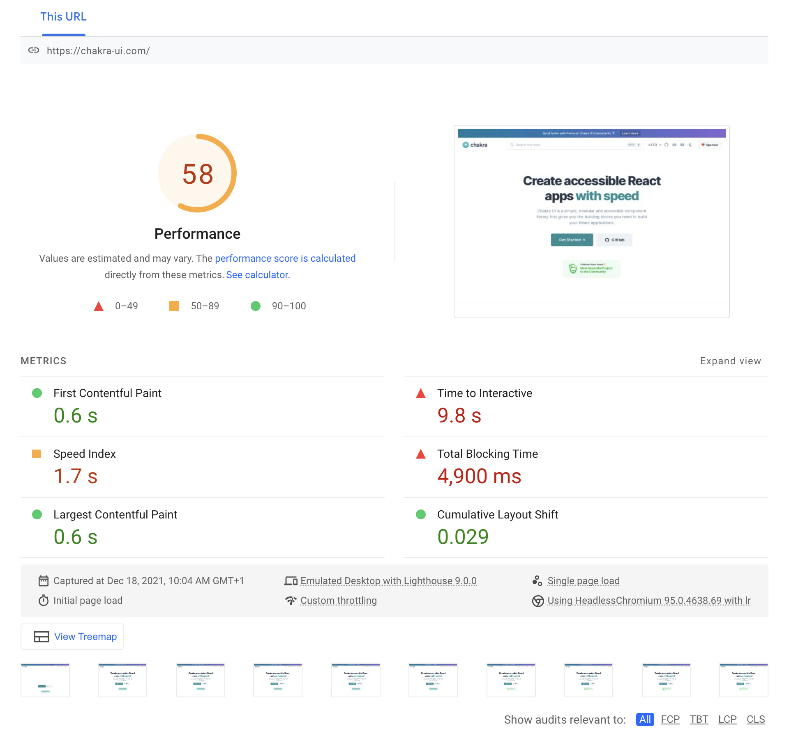
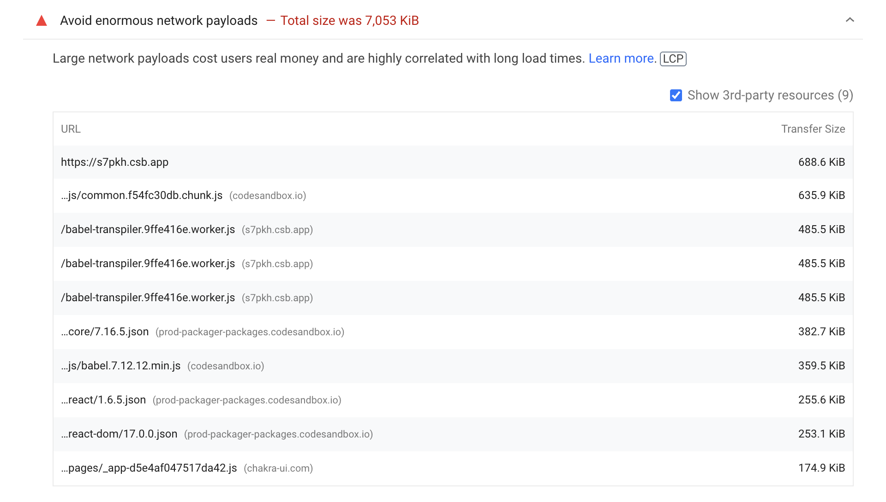
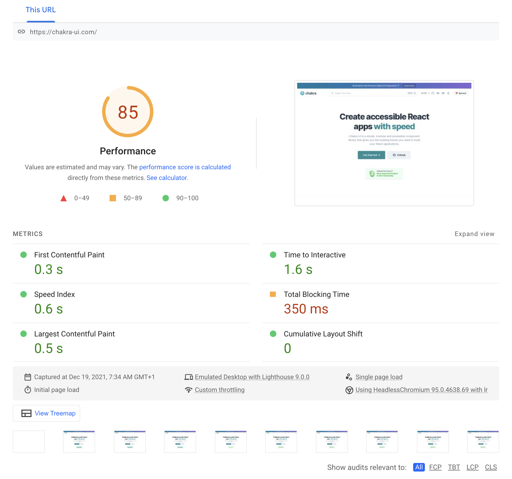

I've noticed that the PageSpeed scores for
[https://chakra-ui.com](https://chakra-ui.com) were not that great. I know that
we've built the page using the best practices, but for some reason the scores
weren't what we expected. I took some time to analyze the metrics and noticed
that the TTI (Time to Interactive) and TBT (Total Blocking Time) were crazy
high!



Scrolling down in the Diagnostics section I noticed the "Avoid enormous network
payloads" issue, notifying me that the total size of the network payload was
7,053 KiB, and that's way too much! Clicking on the issue revealed that 9 out of
10 requests are from CodeSandbox, because of the CodeSandbox embed that was on
the page.



Then I remembered that CodeSandbox released their
[Sandpack](https://sandpack.codesandbox.io/) component toolkit that you can use
to create live code editing blocks. Since that's an npm package that you
install, I figured it will definitely be more performant because its code will
be compiled, optimized and shipped along with the page. So I decided to swap out
the old embedded `iframe` with the new Sandpack component. And the results were
surprizing:



All of the metrics have been improved significantly:

- CLS: `0.029` -> `0` 🚀
- FCP: `0.6s` -> `0.3s` 🚀
- LCP: `0.6s` -> `0.5s` 🚀
- SI: `1.7s` -> `0.6s` 🚀🚀
- TTI: `9.8s` -> `1.6s` 🚀🚀🚀
- TBT: `4.9s` -> `0.35s` 🚀🚀🚀
- Overall Score: `58` -> `85` 🚀🚀🚀

Let's walk through the changes. First, I installed the Sandpack package:

```shell
yarn add @codesandbox/sandpack-react
```

Then I created a simple and generic component that displays the `Sandpack`
component, but allows the data to be provided from the outside:

```tsx
// src/components/sandpack-embed/index.tsx

import { Box, BoxProps } from '@chakra-ui/react'
import { Sandpack, SandpackProps } from '@codesandbox/sandpack-react'
import '@codesandbox/sandpack-react/dist/index.css'

const SandpackEmbed = (props: BoxProps & SandpackProps) => {
  return (
    <Box
      as={Sandpack}
      {...props}
      options={{
        ...props.options,
        showLineNumbers: true,
      }}
      theme='dark'
      template='react-ts'
      customSetup={{
        dependencies: {
          react: '17.0.2',
          'react-dom': '17.0.2',
          'react-scripts': '4.0.0',
          'react-icons': '3.11.0',
          '@chakra-ui/react': '1.7.3',
          '@chakra-ui/icons': '^1.1.1',
          '@emotion/react': '^11.7.0',
          '@emotion/styled': '^11.6.0',
          'framer-motion': '^4.1.17',
        },
      }}
    />
  )
}

export default SandpackEmbed
```

It's basically a `Box` component, rendered as a `Sandpack` component, but its
props are the `BoxProps` merged with `SandpackProps`. That way we can pass
Chakra style props, and Sandpack configuration props and reuse this component
everywhere.

Then I simply replaced the `iframe` on the homepage with the new `SandpackEmbed`
component:

```tsx
<SandpackEmbed
  options={{
    editorHeight: 600,
    editorWidthPercentage: 60,
  }}
  files={{
    '/src/App.tsx': App,
    '/src/index.tsx': Index,
  }}
  zIndex={0}
  tabIndex={-1}
/>
```

The `App` and `Index` variables that you see on line 7 and 8 are simple strings.
It's the code content that we want to have inside of each file specifically:

```tsx
export const Index = `import * as React from "react";
import { render } from "react-dom";
import { ChakraProvider } from "@chakra-ui/react";
import App from "./App";
const rootElement = document.getElementById("root");
render(
  <ChakraProvider>
    <App />
  </ChakraProvider>,
  rootElement
);`
```

And that was it! A simple change drastically improved the page speed, and also
opened up possibilities to reuse the `SandpackEmbed` component throughout the
whole website. I plan on swapping the
[react-live](https://www.npmjs.com/package/react-live) package with the
`SandpackEmbed` as well. I'm not sure about performance boost, but a bonus
feature will be the ability to create a CodeSandbox sandbox directly from the
website.

Here's the PR if you're interested to see all of the details about it:

[](https://github.com/chakra-ui/chakra-ui-docs/pull/154)
